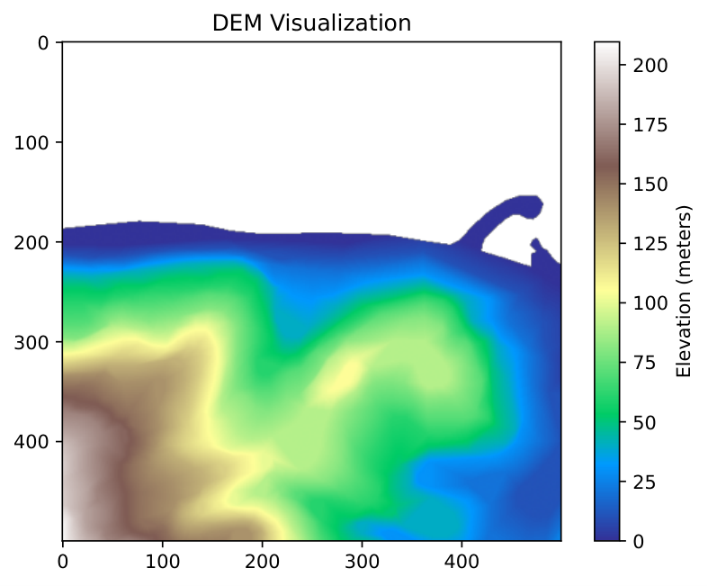
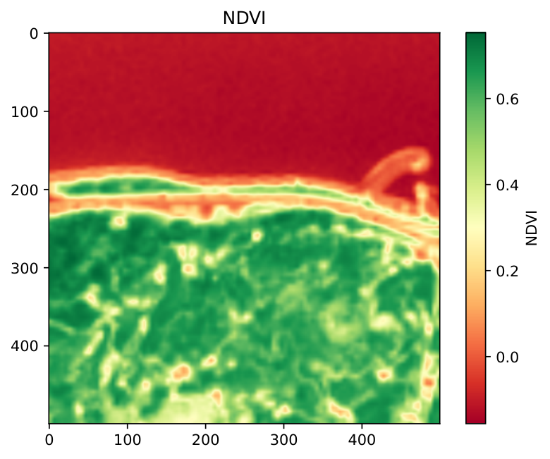
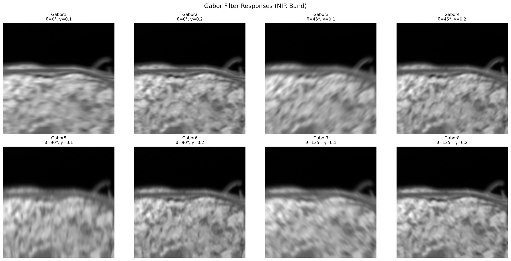
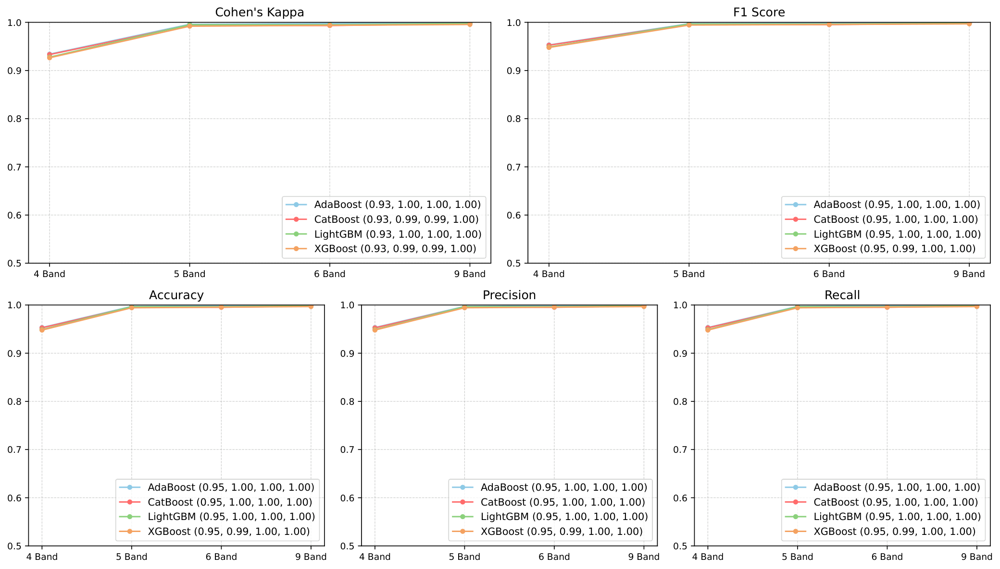
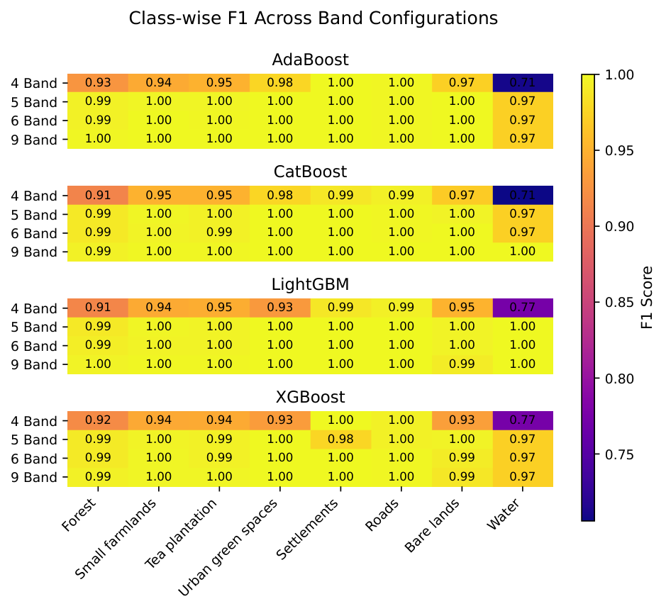
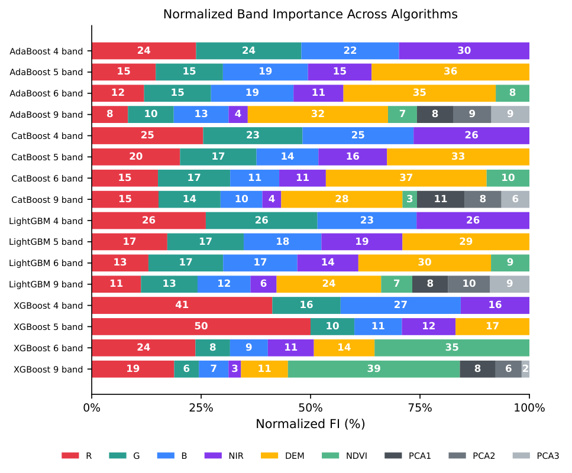
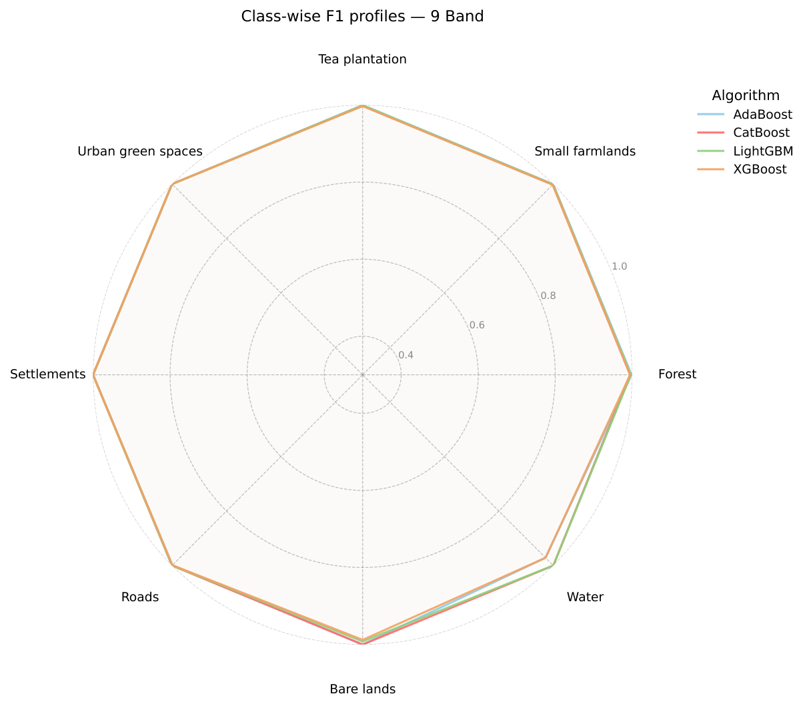

# LU/LC Classification

Supervised machine learning classification of land use / land cover (LULC)
from multi-band satellite imagery and a digital elevation model.

> This repository contains the code accompanying the paper:
> **"Classification of land use and land cover (LU/LC) of a high-resolution
> Pléiades satellite image using different machine learning algorithms"**
> *(under review — citation will be updated upon publication)*

---

## Overview

| Property | Value |
|:---------|:------|
| Study area | Turkey (ED 1950 UTM Zone 37N — EPSG:23037) |
| Image resolution | 2 m/pixel |
| Full image size | 8 404 × 7 202 pixels |
| Training polygons | 2 057 |
| Number of classes | 8 |

**Land cover classes:**
Forest · Small farmlands · Tea plantation · Urban green spaces ·
Settlements · Roads · Bare lands · Water

### Band Configurations

| Configuration | Bands | Feature set |
|:-------------|:------|:------------|
| `4b` | R, G, B, NIR | Spectral only |
| `5b` | R, G, B, NIR, DEM | + Topographic |
| `6b` | R, G, B, NIR, DEM, NDVI | + Vegetation index |
| `9b` | R, G, B, NIR, DEM, NDVI, PCA1, PCA2, PCA3 | + Gabor texture (PCA) |

### Algorithms

AdaBoost · CatBoost · LightGBM · XGBoost

---

## Installation (Anaconda — Recommended)

> **Why Anaconda?**
> The GDAL library has C/C++ dependencies that cannot be installed directly via `pip`.
> Anaconda (conda-forge) provides pre-compiled binary packages that simplify the setup.

### Step 1 — Create the conda environment

```bash
conda env create -f env/environment.yml
```

This command creates the environment and installs all dependencies including GDAL.
Initial setup may take a few minutes depending on your internet connection.

### Step 2 — Activate the environment

```bash
conda activate rs-classification
```

### Step 3 — Register the Jupyter kernel *(optional)*

If you use VS Code or JupyterLab:

```bash
python -m ipykernel install --user \
    --name rs-classification \
    --display-name "Python (rs-classification)"
```

### Step 4 — Launch Jupyter from the project root

```bash
cd lulc-classification
jupyter notebook
```

> **Important:** Jupyter must be launched from inside the `lulc-classification/` directory.
> If opened from a different directory, the project root cannot be located and the notebooks will fail.

### pip Installation *(without GDAL, alternative)*

```bash
pip install -r requirements/requirements.txt
# GDAL must be installed separately via conda:
conda install -c conda-forge gdal>=3.8
```

### Common Installation Issues

| Issue | Solution |
|:------|:---------|
| `ImportError: No module named 'osgeo'` | Is `conda activate rs-classification` active? |
| GDAL version mismatch | `conda update -c conda-forge gdal` |
| LightGBM OpenMP error on macOS | The `n_jobs=1` setting in `models.py` prevents this issue |

---

## Sample Data

The `data/` directory contains a 500 × 500 pixel sample for pipeline demonstration.

| File | Content |
|---|---|
| `data/image.tif` | 4-band image (R, G, B, NIR), 2 m/px, EPSG:23037 |
| `data/dem.tif` | Digital elevation model, same grid |
| `data/training/` | Training polygons and study area shapefiles |

**Imagery source:** Sentinel-2C Level-2A (tile T37TFF, acquired 2026-05-08,
© European Union, Copernicus Programme).
Bands B04/B03/B02/B08 were stacked and resampled from 10 m to 2 m/px
(bilinear) to match the spatial resolution of the study.

> The actual research was conducted on a Pleiades PHR1B image
> (© CNES 2021, Distribution Airbus DS) acquired under an Academic Licence.
> That image cannot be redistributed; the Sentinel-2 crop above is provided
> solely as a runnable code example covering the same geographic area.

---

## Quick Start

Sample data (500 × 500 pixels) is included in `data/`.
Follow these steps in order:

1. **`notebooks/01_prepare.ipynb`** → *Kernel → Restart & Run All*
   *(Generates NDVI, Gabor features, PCA, and training labels — run once)*

2. **`notebooks/02_classify.ipynb`** → set `BAND_CONFIG` → *Restart & Run All*
   *(Repeat four times, once per band configuration)*

3. **`notebooks/03_visualize.ipynb`** → *Restart & Run All*
   *(Tables and figures are saved under `results/`)*

### Pipeline Outputs (sample)

| | |
|---|---|
|  |  |



### Using Your Own Data

1. Replace the files in `data/` with your own (keep the same filenames)
2. Populate the `id` and `class` columns in `training_polygons.shp`'s attribute table
   with your own class labels
3. Update the `band_names` lists in `config/hyperparameters.yaml` to match your band order
4. Run the three notebooks in order

> Class names are read automatically from `training_polygons.shp` — no code changes required.

---

## Project Structure

```
lulc-classification/
│
├── config/
│   └── hyperparameters.yaml     # Band configurations and hyperparameter grids
│
├── data/
│   ├── image.tif                # 4-band satellite image (R, G, B, NIR)
│   ├── dem.tif                  # Digital elevation model
│   ├── training/
│   │   ├── training_polygons.shp   # Training polygons (+ .dbf .prj .shx .cpg)
│   │   └── study_area.shp          # Study area boundary (+ .dbf .prj .shx .cpg)
│   └── processed/               # Outputs of 01_prepare.ipynb (git-ignored)
│
├── notebooks/
│   ├── 01_prepare.ipynb         # Data preparation (run once)
│   ├── 02_classify.ipynb        # Classification (once per band configuration)
│   └── 03_visualize.ipynb       # Results visualization and reporting
│
├── src/
│   ├── config.py                # Central path definitions and YAML loader
│   ├── data_loading.py          # Raster loading and shapefile DBF parsing
│   ├── models.py                # Algorithm definitions and GridSearchCV wrapper
│   ├── metrics.py               # Class names and runlog update utilities
│   ├── raster_io.py             # Save prediction results as GeoTIFF
│   └── validation.py            # Input file compatibility checks
│
├── results/                     # All outputs (git-ignored)
│   ├── processed/               # Intermediate rasters (ndvi, pca, masked image)
│   ├── models/                  # Trained models (.pkl)
│   ├── predictions/             # Prediction maps (.tif)
│   ├── figures/                 # Figures (.pdf)
│   ├── tables/                  # Metric tables (.csv) and runlog
│   └── logs/                    # Timestamped run summaries
│
├── env/
│   └── environment.yml          # Conda environment (recommended)
├── requirements/
│   └── requirements.txt         # pip fallback (without GDAL)
├── .gitignore
└── README.md
```

---

## Input Validation

When `01_prepare.ipynb` is run, all input files are automatically checked before any processing begins.
If any problem is found, an error is raised before the workflow starts.

### What is checked?

**Raster files** (`image.tif`, `dem.tif`):

| Check | Why it matters |
|:------|:--------------|
| Coordinate reference system (CRS) | Mismatched projections break pixel alignment |
| Dimensions (pixel count) | Different sizes mean bands cannot be stacked |
| Resolution (m/pixel) | Different resolutions cause incorrect pixel matching |
| Origin (top-left corner) | Different origins mean images do not cover the same area |

**Vector files** (`training_polygons.shp`, `study_area.shp`):

| Check | Why it matters |
|:------|:--------------|
| Coordinate reference system (CRS) | Different projection from rasters shifts polygons to wrong pixels |
| Intersection with raster extent | A vector entirely outside the raster yields no training data |

> **Note:** Training polygons covering a smaller area than the raster is normal —
> not every pixel needs to be labelled.

### What to do if you get an error?

```
✗ CRS mismatch: dem.tif (EPSG:4326) ≠ image.tif (EPSG:23037)
```
→ Reproject the DEM to the same coordinate system as the image using QGIS or `gdalwarp`.

```
✗ Dimension mismatch: dem.tif (8000×6000) ≠ image.tif (8404×7202)
```
→ Align the DEM to the same grid as the image with `gdalwarp` (`-te`, `-ts` flags).

```
✗ Extent error: training_polygons.shp does not intersect the raster extent
```
→ Verify in QGIS that the polygons and image cover the same geographic area.

---

## Adding a New Band Configuration

1. Add a new block to `config/hyperparameters.yaml` (use the template at the bottom of the file)
2. Set `BAND_CONFIG = "10b"` in `02_classify.ipynb`
3. Run the notebook — `results/tables/runlog.csv` and `03_visualize.ipynb` update automatically

---

## Results

### Research Results (Full Pleiades Image — 8 404 × 7 202 px)

The table below reports results from the actual study conducted on the full
Pleiades PHR1B image. These are the numbers referenced in the associated publication.

| Algorithm | Band Configuration | Accuracy | Weighted F1 | Cohen's Kappa |
|:----------|:------------------|:--------:|:-----------:|:-------------:|
| AdaBoost  | 4 Band | 0.85 | 0.85 | 0.79 |
| AdaBoost  | 9 Band | 0.98 | 0.98 | 0.97 |
| CatBoost  | 4 Band | 0.87 | 0.86 | 0.81 |
| CatBoost  | 9 Band | 0.97 | 0.97 | 0.95 |
| LightGBM  | 4 Band | 0.86 | 0.86 | 0.80 |
| LightGBM  | 9 Band | **0.98** | **0.98** | **0.97** |
| XGBoost   | 4 Band | 0.85 | 0.85 | 0.79 |
| XGBoost   | 9 Band | 0.97 | 0.97 | 0.96 |

**Best configuration:** 9 Band + LightGBM — Accuracy: 0.976, Kappa: 0.966

---









---

> **Note on the included sample data**
>
> The `data/` directory contains a 500 × 500 pixel Sentinel-2 crop provided
> solely to make the pipeline runnable out of the box.
> Running the notebooks on this sample will produce near-perfect metrics
> (accuracy ≈ 1.00 on most configurations), which do **not** reflect the
> research results above.
>
> This behaviour is expected and has two causes:
> - **Small spatial extent:** the crop covers only ~1 km² with very few
>   training pixels per class. The models memorise the sample rather than
>   learning generalisable patterns.
> - **Coarser source imagery:** the sample was resampled from 10 m Sentinel-2
>   to 2 m/px; spectral variability is lower than the original 2 m Pleiades data,
>   making classes artificially easy to separate.
>
> To reproduce the results in the table, replace `data/image.tif` with
> a Pleiades (or equivalent 2 m resolution) image of sufficient area.

---

## Citation

If you use this code in your research, please cite the associated paper:

> **Classification of land use and land cover (LU/LC) of a high-resolution
> Pléiades satellite image using different machine learning algorithms**
>
> *Manuscript under review. Citation details will be added upon publication.*

Until the paper is published, you may reference this repository directly:

```
@misc{lulc-classification,
  author  = {Yazici, Bulent Volkan and Ozalp, Mehmet and Akinci, Halil},
  title   = {LU/LC Classification — Pléiades satellite image},
  year    = {2026},
  url     = {https://github.com/volkinen/lulc-classification}
}
```
